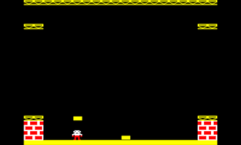

# Block Blitz

Block Blitz was a classic old BBC Micro game which was published in Beebug magazine in 1984 and was then a staple in game compilation floppies that got shared around (this was long before the internet made sharing easy). 

This Playdate remake aims to copy the original precisely in a single main.lua file.

# Online Playable Version

[Block Blitz](http://bbcmicro.co.uk//jsbeeb/play.php?autoboot&disc=http://bbcmicro.co.uk//gameimg/discs/1226/Disc069-BlockBlitz.ssd&noseek)

# Source Code and porting

Some badly formatted original source is available on Internet Archive:

[Elbug_v1_n4_Mar_1984_djvu.txt](https://archive.org/stream/elbug-magazine-1984-03/Elbug_v1_n4_Mar_1984_djvu.txt)

The game used BBC Micro Mode 5 graphics, 160x256 pixels, and had a 20x32 grid of 8x8 graphics, but the 8x8 graphics had a 2:1 ratio, they weren't square, so for our purposes 16x8.

[beebwiki.mdfs.net/MODE_5](https://beebwiki.mdfs.net/MODE_5).

