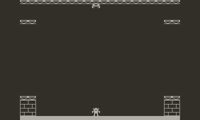

# Block Blitz

| BBC Micro|Playdate|
| ----------- | ----------- |
|       |        |

Block Blitz was a classic old BBC Micro game which was published in Beebug magazine in 1984 and was then a staple in game compilation floppies that got shared around (this was long before the internet made sharing easy). 

This [Playdate](https://play.date/) remake aims to copy the original precisely in a [single hacked together main.lua file](https://github.com/orllewin/playdate_blockblitz/blob/main/Source/main.lua).

# Playdate Download

Download the zipped .pdx below to sideload onto your Playdate, or get it from [itch.io and give me some money](https://orllewin.itch.io/block-blitz):

# Browser Playable Version

Running in an emulator, though I'm sure it runs slower on hardware:
[Block Blitz](http://bbcmicro.co.uk//jsbeeb/play.php?autoboot&disc=http://bbcmicro.co.uk//gameimg/discs/1226/Disc069-BlockBlitz.ssd&noseek)

# Source Code and porting

Original source listing in Beebug magazine:

[BEEBUG_Vol_2_No_8_JAN_FEB_1984.pdf](./web_assets/BEEBUG_Vol_2_No_8_JAN_FEB_1984.pdf)

The game used BBC Micro Mode 5 graphics, 160x256 pixels, and had a 20x32 grid of 8x8 graphics, but the 8x8 graphics had a 2:1 ratio, they weren't square, so for our purposes 16x8.

[beebwiki.mdfs.net/MODE_5](https://beebwiki.mdfs.net/MODE_5).

